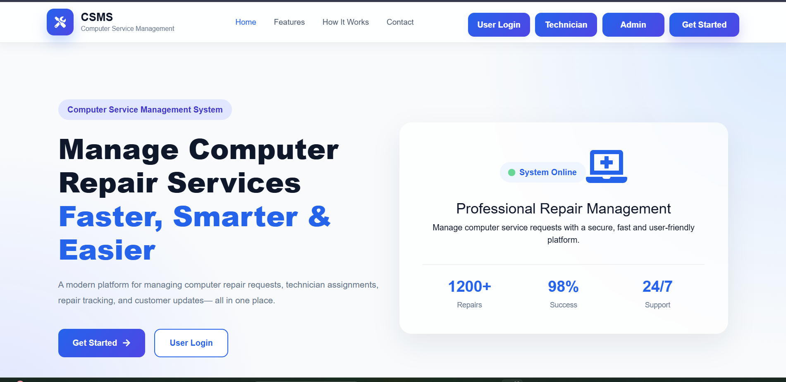
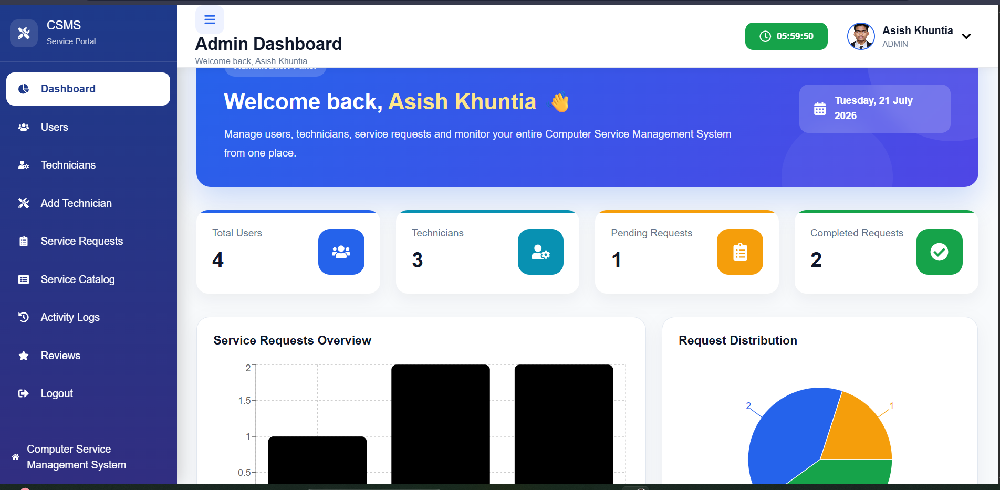
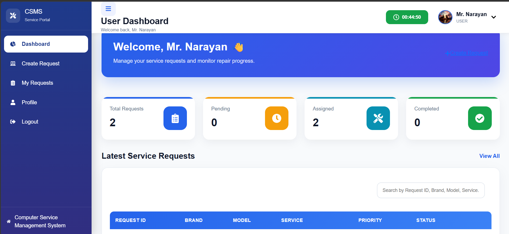
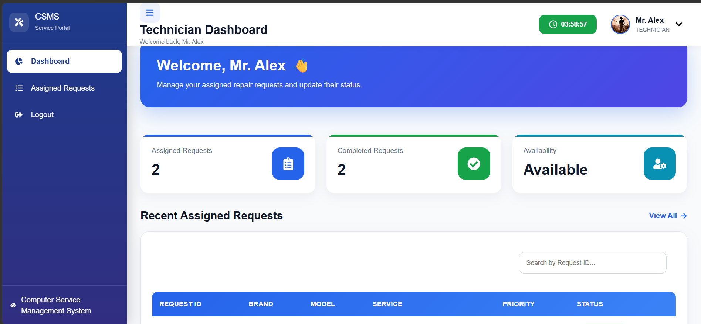
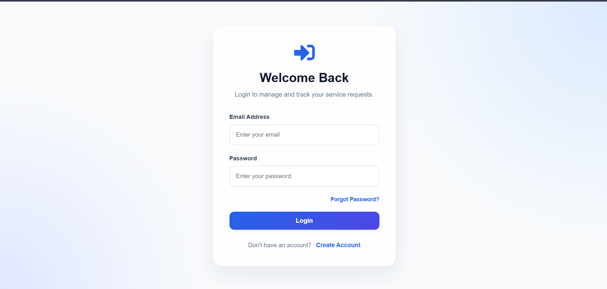
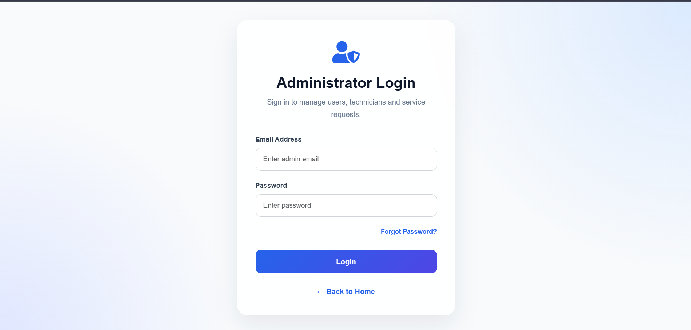
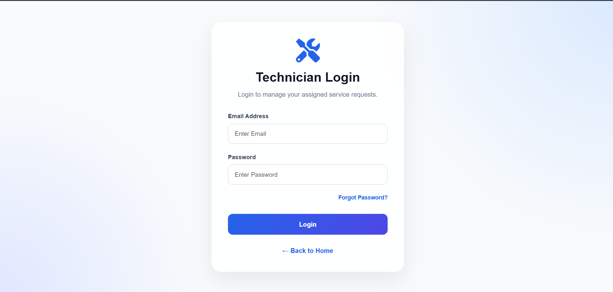

<div align="center">

# 🖥️ Computer Service Management System (CSMS)

### A Full Stack Computer Repair Service Management Platform

Built using **Spring Boot**, **Spring Security (JWT)**, **PostgreSQL**, and **React.js**


</div>

---

# 📖 Overview

Computer Service Management System (CSMS) is a secure web application developed to streamline computer repair services.

The application enables customers to create service requests, administrators to manage technicians and monitor requests, and technicians to update repair progress in real time.

The project follows a clean layered architecture with JWT-based authentication and RESTful APIs.

---

# ✨ Key Features

## 👤 User

- User Registration & Login
- JWT Authentication
- Forgot Password with OTP
- Profile Management
- Create Service Request
- Track Repair Status
- Upload Service Images
- Download Invoice
- Submit Reviews

---

## 👨‍💼 Admin

- Dashboard Analytics
- Manage Users
- Manage Technicians
- Assign Technicians
- Manage Service Requests
- Manage Service Catalog
- Activity Logs
- Review Management

---

## 👨‍🔧 Technician

- Technician Login
- Dashboard
- Assigned Requests
- Update Request Status
- Availability Tracking

---

# 🔒 Security

- Spring Security
- JWT Authentication
- BCrypt Password Encryption
- Role-Based Authorization
- Stateless Authentication
- Protected REST APIs

---

# 🛠 Tech Stack

## Backend

- Java 21
- Spring Boot
- Spring Security
- Spring Data JPA
- Hibernate
- JWT
- PostgreSQL
- Maven

## Frontend

- React.js
- Vite
- Axios
- Bootstrap
- React Router

---

# 📸 Application Screenshots

## Home Page



---

## Admin Dashboard



---

## User Dashboard



---

## Technician Dashboard



---

## User Login



---

## Admin Login



---

## Technician Login



---

# 🏗 Backend Architecture

```
                 Client (React)

                       │

                REST API Requests

                       │

               Spring Boot Controllers

                       │

                 Service Layer

                       │

               Repository Layer

                       │

                 PostgreSQL Database
```

---

# 📁 Project Structure

```
Computer_Service_Management_System

│
├── backend
│   ├── config
│   ├── controller
│   ├── dto
│   ├── entity
│   ├── repository
│   ├── security
│   ├── services
│   ├── exception
│   └── ...
│
├── frontend
│   ├── assets
│   ├── components
│   ├── pages
│   ├── services
│   └── ...
│
└── README.md
```

---

# 🗄 Database

**Database:** PostgreSQL

### Main Tables

- Users
- Admins
- Technicians
- Service Requests
- Service Catalog
- Reviews
- Invoices
- OTP Verification
- Activity Logs

---

# 🚀 Getting Started

## Clone Repository

```bash
git clone https://github.com/Asish-74/Computer_Service_Management_System.git

cd Computer_Service_Management_System
```

---

## Backend

```bash
cd backend
```

Configure

```
src/main/resources/application.properties
```

Example

```properties
spring.datasource.url=jdbc:postgresql://localhost:5432/csms
spring.datasource.username=postgres
spring.datasource.password=your_password

spring.jpa.hibernate.ddl-auto=update
```

Run

```bash
mvn clean install

mvn spring-boot:run
```

Backend

```
http://localhost:8080
```

---

## Frontend

```bash
cd frontend

npm install

npm run dev
```

Frontend

```
http://localhost:5173
```

---

# ⭐ Backend Highlights

- Layered Architecture
- RESTful APIs
- Spring Security
- JWT Authentication
- DTO Pattern
- Global Exception Handling
- File Upload
- Invoice PDF Generation
- OTP Email Verification
- Activity Logging
- Role-Based Access Control

---

# 📈 Future Improvements

- Swagger Documentation
- Docker Support
- AWS Deployment
- CI/CD Pipeline
- Redis Cache
- Unit & Integration Testing

---

# 👨‍💻 Author

**Asish Khuntia**

Java Full Stack Developer

- Java
- Spring Boot
- Spring Security
- React.js
- PostgreSQL
- REST APIs

---

<div align="center">

⭐ If you found this project helpful, please consider giving it a star.

</div>